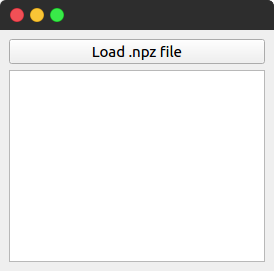

# npzviewer
 

 

A simple .npz file viewer, built with PyQt5

## install 

Just get it from pypi

    pip install npzviewer

## Usage

You can run it either with `python -m npzviewer` from this directory or using `npzviewer` once installed.

    usage: npzviewer [-h] [-v] [npzfile]

    npzviewer is a .npz viewer, for numpy saved files.

    positional arguments:
      npzfile        a single .npz file

    optional arguments:
      -h, --help     show this help message and exit
      -v, --version  get software version.

    Copyright 2018 Erico Vieira Porto, GPLv2.
    
## Develop

Clone this repo somewhere on your system and change directory to it.

    git clone git@github.com:ericoporto/npzviewer
    cd npzviewer/

You will need to meet this project [dependencies](#dependencies). You can install the requirements for your user.
[Alternatively you can also use a Virtual Environment](https://stackoverflow.com/questions/41427500/creating-a-virtualenv-with-preinstalled-packages-as-in-requirements-txt).

    pip install --user -r requirements.txt 

And then run it from the current directory

    python -m npzviewer
    
On ubuntu, use pyton3 and pip3 instead. 

## dependencies

This project depends on **`pyqt5`** and **`numpy`**.

## License and author

This project is provided by Érico Vieira Porto and is GPL-2.0 licensed, see [`LICENSE`](LICENSE) for more details.
